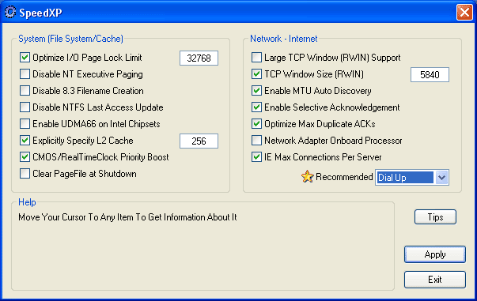



## SpeedXP

### Description

SpeedXP is a tool to change the hidden settings in registry to optimize the WindowsXP Operating System including file system memory and network.

Please compile the program to see the visual styles on controls.

A manifest file is included
 
### More Info
 

             |
---                |---
**Submitted On**   |2002-04-02 17:21:18
**By**             |[Asim Aziz](https://github.com/Planet-Source-Code/PSCIndex/blob/master/ByAuthor/asim-aziz.md)
**Level**          |Intermediate
**User Rating**    |4.2 (25 globes from 6 users)
**Compatibility**  |VB 6\.0
**Category**       |[Registry](https://github.com/Planet-Source-Code/PSCIndex/blob/master/ByCategory/registry__1-36.md)
**World**          |[Visual Basic](https://github.com/Planet-Source-Code/PSCIndex/blob/master/ByWorld/visual-basic.md)
**Archive File**   |[SpeedXP67803422002\.zip](https://github.com/Planet-Source-Code/asim-aziz-speedxp__1-33346/archive/master.zip)

